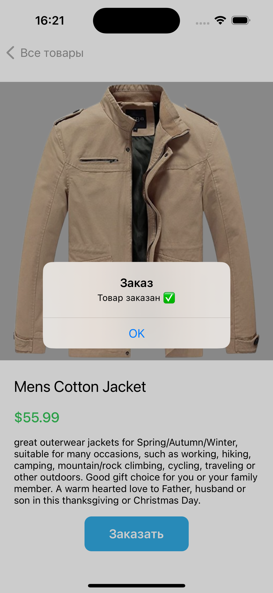

# Products App

Marketplace-style iOS application built with Swift and UIKit.

The app fetches products from FakeStore API and displays them in a list with search functionality and detailed product screen.

## Features

- Fetch products from REST API
- Product list with search
- Product detail screen
- Order simulation with alert
- Async/Await networking
- MVC architecture

## Tech Stack

- Swift
- UIKit
- URLSession
- async/await
- Codable
- MVC

## Screenshots

### Products List

### Product Detail

### Search

### Order Alert

